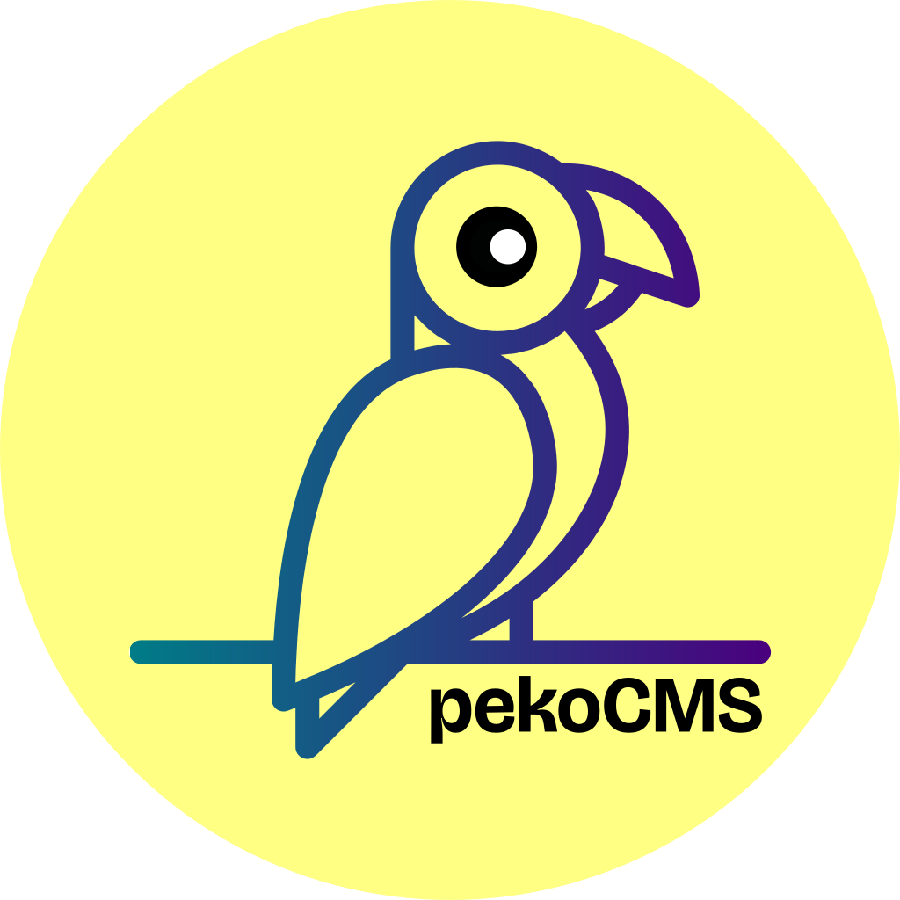

# PekoCMS

<div align="center" style="background-color: white; padding: 20px; border-radius: 10px; display: inline-block;">
    
</div>

<br/>

**PEKO Efficient Kiosk Organiser & Consumer Management System**

PekoCMS is a modern, platform-agnostic kiosk management and clinic administration system designed to streamline polyclinic operations. While currently packaged for Windows, the core application is built on Python and can be adapted for any platform supporting Python & Qt.

## Features
- **Efficient Patient Management**: Streamlined patient entry and record retrieval.
- **Kiosk Mode**: Optimized interface for quick data entry and queue management.
- **Automated Reporting**: Generate PDF reports and invoices effortlessly.
- **Offline Capable**: Robust local database management with sync capabilities.
- **Smart Search**: On-demand SQL querying for instant results across massive catalogues.
- **Dual-Mode Interface**: Switch seamlessly between Pathology and Polyclinic workflows.

## Getting Started

### Installation
For detailed installation instructions, see [Setup Guide](docs/setup.md).

Quick setup:
```bash
pip install -r requirements.txt
python setup.py
```

### Running the App
```bash
python run.py
```

## Documentation
- **Configuration**: [docs/configuration.md](docs/configuration.md) - Learn how to customize branding, assets, and themes.
- **Architecture**: [docs/architecture.md](docs/architecture.md) - Overview of components and efficiency optimizations.
- **Setup**: [docs/setup.md](docs/setup.md) - Environment setup guide.
- **Building**: [docs/building.md](docs/building.md) - Packaging instructions.

---

### Technologies Used: 

Python 3.x
PySide6
SQLite
fpdf2
openpyxl
pydantic
pyyaml
requests
PyInstaller
Inno Setup